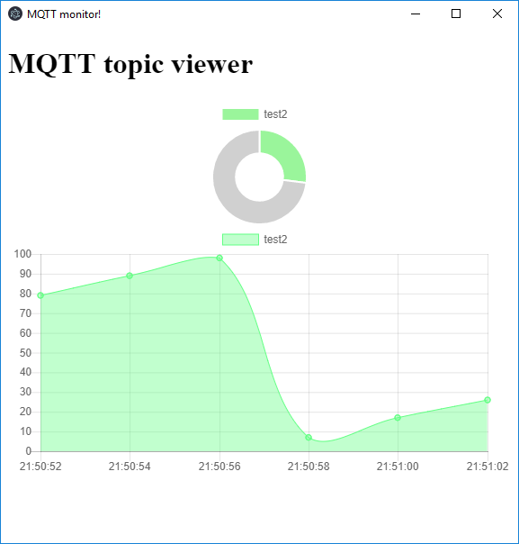

# mqtt_subscibe_viewer
simple mqtt client which subscribes to selected topic (argument) and displays as chart in electron

# Example of creating distribution exe file on windows
`npm run dist`

execute with command line arguments [mqtt_broker_url] [mqtt_topic_to_subscribe] [units of topic]
for example:
`mqtt-monitor.exe mqtt://iot.eclipse.org /topic/my_test/temp Temperature`

